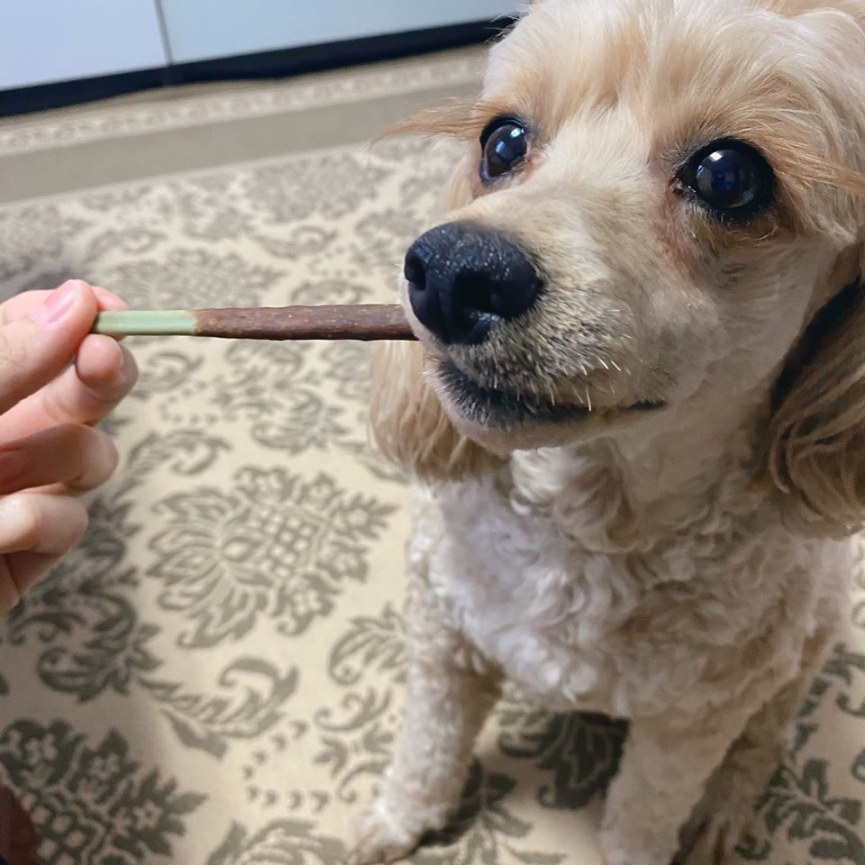

#  MusiQ 

 
실시간 노래 빨리 맞추기 게임 웹 사이트 입니다. 
게스트, 싱글, 멀티 모드로 혼자 혹은 친구들과 함께 게임 가능! 
정답제출과 노래듣기가 키보드로 조작 가능합니다. 스피드하게 게임을 즐겨보세요!

 

## 🚩 기획 의도

노래 빨리 맞추기 게임을 통해서 가볍게 게임을 즐길 수 있습니다.
다양한 년도의 노래가 제공되므로 남녀노소 나이불문 많은 사용자들이 즐길 수 있는 게임입니다.

 

## 🚩 진행 기간

### V1 Guest Mode

2023년 11월 1일 배포완료

### V1.5 Single Mode

2023년 11월 3일 업데이트 예정

### V2 Multi Mode

2023년 11월 10일 업데이트 예정

### V3 MZ Mode

2023년 11월 17일 업데이트 예정

 

## 🚩 참여 인원

### 👨‍💻 BE Dev

|                     강민구                     |                          송종호                          |                          채희찬                          |                          허태민                          |
| :--------------------------------------------: | :------------------------------------------------------: | :------------------------------------------------------: | :------------------------------------------------------: |
| [@rkdalsrn555](https://github.com/rkdalsrn555) |        [@song\_\_ho](https://github.com/ghwhdthd)        |     [@chae-heechan](https://github.com/chae-heechan)     |      [@Heo-Tae-Min](https://github.com/Heo-Tae-Min)      |
|    |  |  |  |

### 👩‍💻 FE Dev

|                          오병철                          |                          이채련                           |
| :------------------------------------------------------: | :-------------------------------------------------------: |
|          [@ping9oo](https://github.com/ping9oo)          |    [@CHAERYEON-LEE](https://github.com/CHAERYEON-LEE)     |
|  |  |

 

## 🚩 기술스택

### BE

### FE

 
![Recoil](https://img.shields.io/badge/Recoil-007af4.svg?style=for-the-badge&logo=data:image/svg+xml;base64,PHN2ZyBpZD0iQ2FscXVlXzEiIGRhdGEtbmFtZT0iQ2FscXVlIDEiIHhtbG5zPSJodHRwOi8vd3d3LnczLm9yZy8yMDAwL3N2ZyIgdmlld0JveD0iMCAwIDI1NS4yMSA2MjMuOTEiPjxkZWZzPjxzdHlsZT4uY2xzLTF7ZmlsbDp3aGl0ZX08L3N0eWxlPjwvZGVmcz48cGF0aCBjbGFzcz0iY2xzLTEiIGQ9Im03NC42MiAyNzcuNDYgMS4yNC0uMTMgMzQuNzgtMy4yOC01My40Ny01OC42NkE5Ni40NyA5Ni40NyAwIDAgMSAzMiAxNTAuM0gzYTEyNS4zIDEyNS4zIDAgMCAwIDMyLjggODQuNTdaTTE3Ny4xMyAzNDdsLTM2IDMuNCA1My4zMiA1OC41MUE5Ni40MSA5Ni40MSAwIDAgMSAyMTkuNjMgNDc0aDI4LjkyYTEyNS4yOCAxMjUuMjggMCAwIDAtMzIuNzYtODQuNTdaIi8+PHBhdGggY2xhc3M9ImNscy0xIiBkPSJNMjUzLjY5IDIzMS42OGMtNi4zMy0zMS4zLTMwLjg5LTU0LjA5LTYyLjU3LTU4LjA3bC02LjM1LS43OWE0OS42MSA0OS42MSAwIDAgMS00My4zNS00OS4xM3YtMjBhNTIuNzUgNTIuNzUgMCAxIDAtMjguOTEtLjM2djIwLjM4YTc4LjU2IDc4LjU2IDAgMCAwIDY4LjY1IDc3LjgybDYuMzYuOGMyMy4yNCAyLjkyIDM0Ljc4IDIwIDM3LjgzIDM1LjFzLS45MyAzNS4zMi0yMS4yMiA0N2E3My44MSA3My44MSAwIDAgMS0zMC4wNiA5LjYybC05NS42NiA5YTEwMi40NSAxMDIuNDUgMCAwIDAtNDEuOCAxMy4zOEM5IDMzMi40NS00LjgxIDM2MyAxLjUyIDM5NC4yOXMzMC44OSA1NC4wOCA2Mi41NyA1OC4wNmw2LjM1LjhhNDkuNiA0OS42IDAgMCAxIDQzLjM1IDQ5LjEydjE4YTUyLjc1IDUyLjc1IDAgMSAwIDI4LjkxLjI2di0xOC4yNmE3OC41NSA3OC41NSAwIDAgMC02OC42NS03Ny44MWwtNi4zNi0uOGMtMjMuMjQtMi45Mi0zNC43OC0yMC4wNS0zNy44My0zNS4xMXMuOTMtMzUuMzIgMjEuMjItNDdhNzMuNjggNzMuNjggMCAwIDEgMzAuMDYtOS42M2w5NS42Ni05YTEwMi40NSAxMDIuNDUgMCAwIDAgNDEuOC0xMy4zOGMyNy42NS0xNi4wMiA0MS40LTQ2LjU0IDM1LjA5LTc3Ljg2WiIvPjwvc3ZnPg==&logoColor=white)

https://img.shields.io/badge/표시할이름-색상?style=for-the-badge&logo=기술스택아이콘&logoColor=white

### Infra

### Tool

## 🚩 V1 guest mode

로그인, 회원가입 필요없이 즐길 수 있습니다.  
원하는 난이도와, 년도를 선택 후 게임을 시작하세요.  
노래는 총 3번 듣기 가능하고, 한 노래에 대한 정답 제출은 총 4번 가능합니다.  
노래 빨리 맞추기 게임은 마라톤 형식으로 누가 안틀리고 가장 많이 맞추는지 대결하는 게임입니다.   

### v1.5 single mode

- 2023/11/1 까지 구현 목표

### v2 multi mode

- 2023/11/3 까지 구현 목표

### v3 MZ mode

- 2023/11/10 까지 구현 목표
