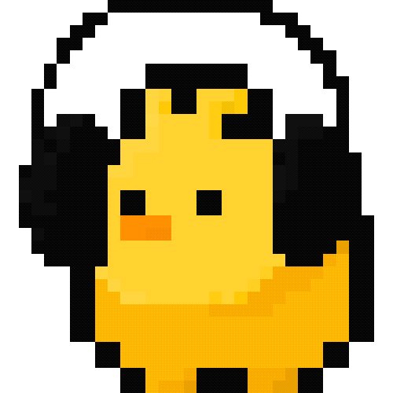

#  MusiQ 

 
실시간 노래 빨리 맞추기 게임 웹 사이트 입니다. 
게스트, 싱글, 멀티 모드로 혼자 혹은 친구들과 함께 게임 가능! 
정답제출과 노래듣기가 키보드로 조작 가능합니다. 스피드하게 게임을 즐겨보세요!

|  |  |  |
| ------------------------------------ | --------------------------------------- | -------------------------------------- |

 

## 🚩 기획 의도

노래 빨리 맞추기 게임을 통해서 가볍게 게임을 즐길 수 있습니다. 
다양한 연도의 노래가 제공되며, 쉬운 조작으로 남녀노소 나이불문 많은 사용자들이 즐길 수 있는 게임입니다.

 

## 🚩 진행 기간

### V1 Guest Mode ✅

2023년 11월 1일 배포완료

### V1.5 Single Mode ✅

2023년 11월 9일 배포완료

### V2 Multi Mode ✅

2023년 11월 16일 배포완료

### V3 MZ Mode 💬

2023년 12월 25일 업데이트 예정 🎄

 

## 🚩 참여 인원

### 👨‍💻 BE Dev

|                     강민구                     |                          송종호                          |                          채희찬                          |                          허태민                          |
| :--------------------------------------------: | :------------------------------------------------------: | :------------------------------------------------------: | :------------------------------------------------------: |
| [@rkdalsrn555](https://github.com/rkdalsrn555) |        [@song\_\_ho](https://github.com/ghwhdthd)        |     [@chae-heechan](https://github.com/chae-heechan)     |      [@Heo-Tae-Min](https://github.com/Heo-Tae-Min)      |
|    |  |  |  |

### 👩‍💻 FE Dev

|                          오병철                          |                          이채련                          |
| :------------------------------------------------------: | :------------------------------------------------------: |
|          [@ping9oo](https://github.com/ping9oo)          |    [@CHAERYEON-LEE](https://github.com/CHAERYEON-LEE)    |
|  |  |

 

## 🚩 기술스택

### BE

### FE

 
![Recoil](https://img.shields.io/badge/Recoil-007af4.svg?style=for-the-badge&logo=data:image/svg+xml;base64,PHN2ZyBpZD0iQ2FscXVlXzEiIGRhdGEtbmFtZT0iQ2FscXVlIDEiIHhtbG5zPSJodHRwOi8vd3d3LnczLm9yZy8yMDAwL3N2ZyIgdmlld0JveD0iMCAwIDI1NS4yMSA2MjMuOTEiPjxkZWZzPjxzdHlsZT4uY2xzLTF7ZmlsbDp3aGl0ZX08L3N0eWxlPjwvZGVmcz48cGF0aCBjbGFzcz0iY2xzLTEiIGQ9Im03NC42MiAyNzcuNDYgMS4yNC0uMTMgMzQuNzgtMy4yOC01My40Ny01OC42NkE5Ni40NyA5Ni40NyAwIDAgMSAzMiAxNTAuM0gzYTEyNS4zIDEyNS4zIDAgMCAwIDMyLjggODQuNTdaTTE3Ny4xMyAzNDdsLTM2IDMuNCA1My4zMiA1OC41MUE5Ni40MSA5Ni40MSAwIDAgMSAyMTkuNjMgNDc0aDI4LjkyYTEyNS4yOCAxMjUuMjggMCAwIDAtMzIuNzYtODQuNTdaIi8+PHBhdGggY2xhc3M9ImNscy0xIiBkPSJNMjUzLjY5IDIzMS42OGMtNi4zMy0zMS4zLTMwLjg5LTU0LjA5LTYyLjU3LTU4LjA3bC02LjM1LS43OWE0OS42MSA0OS42MSAwIDAgMS00My4zNS00OS4xM3YtMjBhNTIuNzUgNTIuNzUgMCAxIDAtMjguOTEtLjM2djIwLjM4YTc4LjU2IDc4LjU2IDAgMCAwIDY4LjY1IDc3LjgybDYuMzYuOGMyMy4yNCAyLjkyIDM0Ljc4IDIwIDM3LjgzIDM1LjFzLS45MyAzNS4zMi0yMS4yMiA0N2E3My44MSA3My44MSAwIDAgMS0zMC4wNiA5LjYybC05NS42NiA5YTEwMi40NSAxMDIuNDUgMCAwIDAtNDEuOCAxMy4zOEM5IDMzMi40NS00LjgxIDM2MyAxLjUyIDM5NC4yOXMzMC44OSA1NC4wOCA2Mi41NyA1OC4wNmw2LjM1LjhhNDkuNiA0OS42IDAgMCAxIDQzLjM1IDQ5LjEydjE4YTUyLjc1IDUyLjc1IDAgMSAwIDI4LjkxLjI2di0xOC4yNmE3OC41NSA3OC41NSAwIDAgMC02OC42NS03Ny44MWwtNi4zNi0uOGMtMjMuMjQtMi45Mi0zNC43OC0yMC4wNS0zNy44My0zNS4xMXMuOTMtMzUuMzIgMjEuMjItNDdhNzMuNjggNzMuNjggMCAwIDEgMzAuMDYtOS42M2w5NS42Ni05YTEwMi40NSAxMDIuNDUgMCAwIDAgNDEuOC0xMy4zOGMyNy42NS0xNi4wMiA0MS40LTQ2LjU0IDM1LjA5LTc3Ljg2WiIvPjwvc3ZnPg==&logoColor=white)

### Infra

### Tool

## 🚩 V1 guest mode

로그인, 회원가입 필요없이 즐길 수 있습니다.  
원하는 난이도와, 연도를 선택 후 게임을 시작하세요.  
노래는 총 3번 듣기 가능하고, 한 노래에 대한 정답 제출은 총 4번 가능합니다.  
노래 빨리 맞추기 게임은 마라톤 형식으로 누가 안틀리고 가장 많이 맞추는지 대결하는 게임입니다.   
|  |  |
| ----------------------------------- | ----------------------------------- |
|  |  |
|  |

 

## 🚩 V1.5 single mode

로그인, 회원가입 후 즐길 수 있습니다.  
원하는 난이도와, 연도를 선택 후 게임을 시작하세요.  
세 번의 하트를 모두 소진하면 게임이 종료됩니다.  
최대 몇 라운드까지 진행할 수 있는지 플레이 해보세요! 

#### 추가된 기능

- 로그인, 회원가입
- 랭킹 시스템
- 싱글모드 플레이 페이지
- 게임 방식 변경
  - 하트 3회 소진 시 게임 종료
  - 모르는 노래 스킵 버튼
  - 게임 종료를 위한 모르겠어요 버튼

|  |  |
| -------------------------------------- | -------------------------------------- |
|   |   |
|   |

## 🚩 V2 multi mode

로그인, 회원가입 후 즐길 수 있습니다.  
원하는 난이도와, 년도, 노래갯수를 선택 후 게임을 시작하세요.  
40초동안 노래가 흘러나오면 채팅창에 빨리 맞추는 사람이 승자!  
누가누가 빨리 많이 맞추는지 친구들과 함께 대결해보세요.  

#### 추가된 기능

- 게임 자동 진행
- 채팅하면서 노래 정답 맞추기
- 노래 스킵가능
- 가수이름, 초성 힌트

|  |  |
| ----------------------------------- | ----------------------------------- |
|  |  |
|  |

## 🚩 V3 MZ mode

- 2023/12/25 까지 구현 목표

## 🚩 ERD

## 🚩 아키텍쳐

## 🚩 API 명세

## 🚩 시연

### 게스트 모드

- 로그인 없이도 플레이 가능한 게스트 모드 입니다.

- 게스트 모드에 입장하면, 게임 옵션 페이지로 이동합니다.
- 게임의 난이도, 연도(복수 선택 가능)를 선택할 수 있습니다.

- 옵션을 선택하고 START 버튼을 클릭하면 게임 플레이 페이지로 이동합니다.
- 음악의 처음, 중간, 끝을 선택해서 한 문제당 3번을 들을 수 있고, 각각 키보드의 좌, 하, 우 방향키로도 조작할 수 있습니다.
- 한 문제 당 정답 제출 기회는 3번이며, Enter 혹은 마우스로 입력 창을 누른 후 정답을 제출할 수 있습니다.
- 정답 제출 기회를 3번 사용하고 정답을 맞추지 못하면 생명(하트)이 하나 감소합니다.

- 문제의 정답을 모를 때는 스킵 버튼을 클릭하거나, 키보드 '.'(온점)을 눌러 스킵할 수 있습니다.
- 스킵을 누르면 생명(하트)가 하나 감소합니다.

- 하트를 모두 소모하면 결과 페이지로 이동하는 '결과보기' 버튼이 생성됩니다.
- 결과 페이지에서 사용자가 선택한 게임 옵션으로 몇 문제를 맞혔는 지 확인할 수 있습니다.

- 카카오톡 공유하기를 이용하여 타인에게 자신의 게임 결과를 공유할 수 있습니다(카카오 로그인 필요).

- 다시하기 버튼을 클릭하면, 직전 게임에서 선택한 게임 옵션들을 저장한 채 게임 옵션 페이지로 돌아갑니다.

### 싱글모드

- 싱글 모드는 로그인을 하고 혼자 게임을 즐길 수 있는 모드입니다.
- 게스트 모드와는 다르게 맞힌 퀴즈 개수에 따라 경험치를 받을 수 있습니다.
- 모드 선택 페이지의 위에 있는 로그인 버튼을 누르면 로그인 페이지로 이동합니다.

- 계정이 없다면 로그인 페이지에서 회원가입 버튼을 클릭하여 회원가입 페이지로 이동할 수 있습니다.
- 아이디, 닉네임, 비밀번호를 입력하여 계정을 생성할 수 있으며, 닉네임과 아이디는 중복이 불가능합니다.

- 가입한 계정으로 로그인을 완료하면, 랜딩 페이지로 돌아갑니다.

- 로그인을 완료했다면, 싱글 모드에 접근할 수 있습니다.
- 싱글 모드를 클릭하면, 게스트 모드와 동일하게 게임 옵션 페이지로 이동합니다.

- 게임 옵션을 모두 선택하고 'START' 버튼을 클릭하면, 게임 플레이 페이지로 이동합니다.
- 게스트 모드와 똑같은 방식으로 게임이 진행됩니다.
- 게임 결과 페이지로 이동하여 결과를 확인할 수 있고, 게스트 모드와 다르게 획득한 경험치를 확인할 수 있습니다.

- 획득한 경험치와 내 순위를 랭킹 페이지에서 확인할 수 있습니다.

### 멀티모드

- 멀티 모드는 로그인을 하고 멀리 떨어진 사람들과도 즐길 수 있는 모드 입니다.
- 게임 모드 선택 페이지에서 멀티 모드를 선택하면, 채널 페이지로 이동합니다.
- 채널 페이지에서는 10개의 채널 중 원하는 채널을 선택할 수 있고, 채널 정원과 현재 해당 채널에 접속한 인원을 확인할 수 있습니다.
- 채널 페이지를 클릭하면 해당 채널의 로비 페이지로 이동합니다.

- 로비 페이지의 좌측에는 현재 채널에 있는 인원이 경험치가 높은 순으로 위에서 아래로 표시됩니다.
- 로비 하단에 보이는 채팅창을 통해 채널에 접속해 있는 사람들과 대화를 할 수 있습니다.

- 로비 우측에 있는 '방 만들기' 버튼을 클릭하여 게임방을 생성할 수 있습니다.
- 버튼을 클릭하면 게임 옵션을 선택할 수 있는 팝업창이 나타납니다.
- 방 제목, 연도(복수 선택 가능), 문제 수를 선택하고 '방 만들기' 버튼을 클릭하거나 키보드 'Enter'키를 누르면 게임방이 생성됩니다.

- 비공개 체크박스를 누르고, 추가적으로 비밀번호를 입력하면 비공개방을 생성할 수 있습니다.

- 게임 방을 만든 방장이 '게임시작' 버튼을 클릭하면 잠시 후 게임이 시작됩니다.
- 하단의 채팅창에서는 자유롭게 방에 입장한 사람들과 채팅을 할 수 있습니다.

- 게임이 시작되면 한 곡을 40초 동안 들려줍니다.
- 게임이 시작되고 10초 후, 재생 중인 곡의 가수 명이 힌트로 제시됩니다.
- 게임이 시작되고 20초 후, 재생 중인 곡 제목의 초성이 힌트로 제시됩니다.

- 채팅창에 정답을 입력할 수 있습니다.
- 정답을 맞힌 사람이 있다면, 맞춘 사람의 점수가 1 증가하고 채팅창에 맞힌 사람의 이름이 표시됩니다.

- 설정한 곡들이 모두 재생되고 나면, 중앙에 순위와 점수가 포함된 순위가 표시됩니다.
- 게임 결과가 나오고 10초가 지나면 다시 대기상태로 돌아갑니다.

- '게임방나가기' 버튼을 클릭하여 게임방에서 로비 페이지로 이동할 수 있습니다.

- 로비에서 다른 사람이 생성한 방을 클릭하여 게임 방에 입장할 수 있습니다.

- 비공개 방을 클릭하면, 비밀번호를 입력하고 입장할 수 있습니다.

- 우측의 '빠른 입장' 버튼을 클릭하여 게임 중이 아닌 공개방에 무작위로 입장할 수 있습니다.

- 우측의 '방 찾기' 버튼을 클릭하고, 방번호를 입력하여 게임 방에 입장할 수 있습니다.

- 비공개방의 방 번호를 검색해서 입장하면, 추가적으로 비밀번호를 입력해야 합니다.

- 우측 상단의 '새로고침' 버튼을 클릭하여, 접속 유저 목록과 게임 방 목록을 새로 불러올 수 있습니다.
