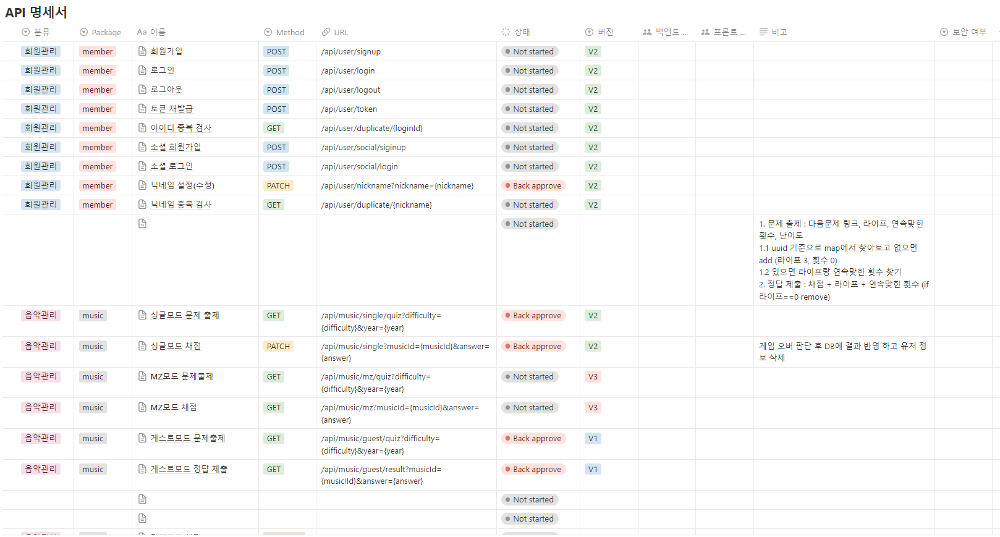
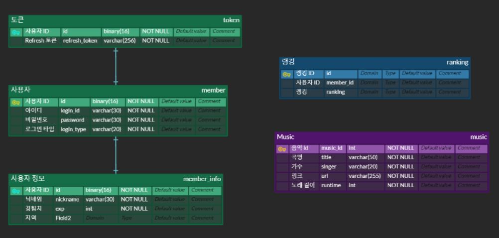
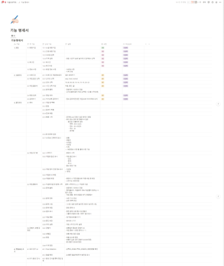

# 10.30 TIL
- 프론트 CD 완료
- nginx 수정 중

---
---
---
# 10.27 TIL
- 백엔드 CI/CD 오류 수정
- 프론트 CI 완료

---
---
---
# 10.26 TIL
- 백엔드 CI/CD 완료

---
---
---
# 10.25 TIL
- CI 완료

---
---
---
# 10.24 TIL

- ERD 완성
---
---
---
# 10.23 TIL

---
---
---
# 10.20 TIL
- 발표
- [발표자료](https://www.canva.com/design/DAFxrE6_PDk/uBcR-wEKRZSr4TErd3pdtA/edit?utm_content=DAFxrE6_PDk&utm_campaign=designshare&utm_medium=link2&utm_source=sharebutton)
- 2주차 회고 진행

---
---
---
# 10.19 TIL
- 기능 명세서 완성
- 발표 준비 및 발표 PPT 작성

---
---
---
# 10.18 TIL

---
---
---
# 10.17 TIL

# 세부 기획 회의
---
# 로그인/회원가입, 랭킹

- 로그인/회원가입 → 스킵 가능
    - 싱글모드는 로그인 없이 로컬 스토리지로
    - 멀티모드는 로그인 있게 구현
    - 회원가입은 소셜, 간편 둘다 가능
    - 간편 회원가입에는 아이디, 비밀번호 입력
    - → 닉네임, 지역 입력
- 랭킹은 실시간 or 3분 or 하루
- 지역별 랭킹도 있으면 좋을듯

# 게임 진행 방식

## V1

### 싱글모드

- 시작할 때 선택지
    - 난이도 선택 → 난이도에 따라 시간 정해짐
    - 년도 선택
- 시간
    1. 시작부터 몇 초간 듣기
    2. 버튼 3개를 누르면 재생 (처음, 중간, 끝부터 듣기)
        1. 1초 단위 기준
            1. easy : 2 , 2 , 2
            2. hard : 1, 1, 1
        2. 0.5 단위 기준
            1. easy : 2 , 2 , 2
            2. normal : 1, 1, 1
            3. hard : 0.5, 0.5, 0.5

- 노래 듣는 횟수 3번
- 게임 당 정답 횟수 몇 번? 3? 2?

- 년도
    - 단위
        - 70, 80, 90, 00년대는 100개씩
        - 70, 80, 90, 00년대, 10~14, 15~19, 20~23 복수선택 가능

- 정답보기
- 끝내기
    - 끝나면 맞은 개수 보여줌

## V2

### 싱글모드

- 모바일 반응형 제공
- 싱글모드
    - SNS 공유 기능

### 멀티 모드

- 로그인/회원가입
    - 간편 로그인 (아이디,비밀번호) → 닉네임
- 빠른 시작
    - 전체 목록에서 랜덤
- 방만들기
    - 방제목
    - 년도
    - 문제 수
        - 10, 30, 50
    - 비밀번호, 비밀방 체크2
        
- 힌트
    - 10초에 가수 초성
    - 20초에 제목 초성
- 스킵
    - 과반수 : 절반을 버리지말고 반올리지말고 올림
- 인원수
    - 6명
- 점수
    - 맞힌 문제수 x 1
- 레벨업
    - 경험치 : 20
- 한 판 끝나면 다시 방으로

---
---
---
# 10.16 TIL

## Spring 비동기 처리

### @EnableAsync

`@Async` 어노테이션이 있는 메서드를 실행할때 해당 메서드가 비동기적으로 실행된다.

→ 보통 멀티스레드 풀인 `ThreadPoolTaskExecutor`를 설정하기 위해 작성한다.

> 
> 
> 1. **Core Pool Size**: **`setCorePoolSize(int corePoolSize)`** 메서드를 사용하여 스레드 풀의 핵심 스레드 수를 설정할 수 있습니다. 핵심 스레드는 작업을 처리하기 위해 항상 활성화되어 있는 스레드의 수를 나타냅니다.
> 2. **Max Pool Size**: **`setMaxPoolSize(int maxPoolSize)`** 메서드를 사용하여 스레드 풀의 최대 스레드 수를 설정할 수 있습니다. 최대 스레드 수는 스레드 풀이 생성할 수 있는 최대 스레드의 수를 나타냅니다.
> 3. **Queue Capacity**: **`setQueueCapacity(int queueCapacity)`** 메서드를 사용하여 대기 중인 작업을 보유할 수 있는 큐의 용량을 설정할 수 있습니다. 작업이 스레드 풀의 핵심 스레드 수를 초과할 경우 대기열에 작업이 대기하게 됩니다.
> 4. **Thread Name Prefix**: **`setThreadNamePrefix(String threadNamePrefix)`** 메서드를 사용하여 생성된 스레드의 이름 접두사를 설정할 수 있습니다. 이를 통해 스레드 이름을 구분할 수 있습니다.
> 5. **Daemon Threads**: **`setDaemon(boolean daemon)`** 메서드를 사용하여 생성된 스레드를 **백그라운드 데몬 스레드**로 설정할 수 있습니다.
> 

### @Async

`@Async(”[ThreadName]”)` : 해당 메서드는 비동기로 실행되며, [ThreadName] 스레드풀에서 관리함.

- `@Async` 어노테이션 내부에서 실행되는 메서드도 비동기로 처리된다.

### DeferredResult

비동기 처리를 수행한 후의 결과를 처리할 때 사용한다.

→ 작업을 서버 백그라운드에서 처리한다.

1. 요청을 받는 Controller에서 `DeferredResult` 객체를 생성한다
2. Service에서 비동기 작업을 수행하고 `DeferredResult` 객체에 결과를 저장한다
3. deferredResult.set(~) 에서 클라이언트에게 response를 전달해 줄 수 있다.
    - 또는 WebSocket이나 SSE(Server-Sent-Events)를 사용해 응답 가능 (결과 푸쉬)
    

DeferredResult<ResponseDto> result = list.remove(1);

게임과 같이 동시 사용자 그룹을 많이 처리하는 경우 비동기 방식으로 여러 요청을 동시에 처리하여 관리하여야 한다(서버 성능).

실시간 채팅, 게임 서버 또는 웹 소켓과 같은 실시간 통신 애플리케이션에서 서버에서 비동기 처리는 클라이언트와 실시간으로 상호작용하기 위해 중요함.

이외에 멀티 스레드 중 여러개의 스레드가 동시에 같은 자원에 접근 할 수 있고(동시성 이슈) 락킹기법이나 메세징 큐를 사용해 해결해야 한다.

→ 데이터 일관성 보장

특화 → 재접근 락으로 특정 스레드가 자원에 접근하는 동안 다른 스레드가 동시에 접근하지 못하게 처리

**비동기 처리 중 이벤트 처리**

https://jongmin92.github.io/2019/03/31/Java/java-async-1/

---
---
---
# 10.12 TIL

[CI/CD, Jenkins] -> [Notion](https://enchanted-seeder-44e.notion.site/CI-CD-c4f4244c95d040479b85d6171f5d95f7?pvs=4)

---
---
---
# 10.13 TIL

## 기획 : 노래 1초 듣고 맞추기 1대1(단체 가능)

### 배경

사용자가 있는 서비스를 만들고 싶다 (최소 4000명)

- **트래픽** 받아보고 싶음 → 트래픽을 많이 받을 수 있는 간단한 게임이 유리함
- **모니터링 경험** 해봐야함 → **빠른 개발 후 빠른 배포** 필수

상용화된 노래 1대1 게임이 없음 → 블루오션

### 타겟

- 최대한 많은 사용자가 사용할 수 있는 서비스 지향

### 기능

- Youtube API
- **실시간**
- 장르를 선택 가능 → 모든 연령대의 대상 맞춤 가능
- 멀티모드, 싱글모드, MT모드
- 멀티모드 매칭 방식
    - 방 만들기 및 들어가기
    - 빠른 입장 (들어갈 수 있는 방 중 랜덤)
    - 티어 맟춤 대기열
- MT 모드 상세
    - STT (Speech To Text)를 사용하여 음성으로 답을 입력할 수 있도록
    - 진행bot (게임의 진행을 도와주도록 알고리즘)
- 추가 기능 (후보)
    - 놀라운 토요일 가사맞추기

### 기술

- 웹소켓
    - cron 스케줄링을 사용해서 실시간 갱신을 해줌
- 스프링 모니터링
    - 트래픽 이슈 해결
- 랭킹 시스템
    - redis 사용
- MSA
    - kafka or RabbitMQ
- 소나 큐브를 활용한 코드리뷰
- jenkins 무중단 배포
    - 개발 서버 운영 서버 나눠서 배포
- 로그인
    - Oauth → 소셜로그인
- 포즈 인식

https://puleugo.tistory.com/17

### 버전

- v0
    - 개인모드
- v1
    - 멀티 모드(1대1)
    - 랭킹
    - 로그인/회원가입
- v2
    - 멀티모드, MT모드
