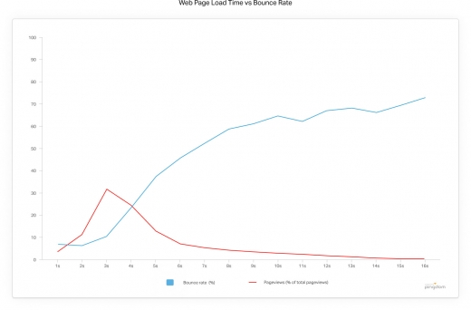
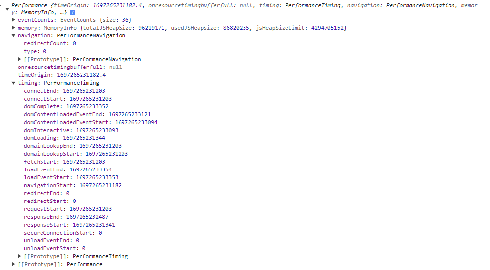

## 웹 성능이란?

웹 성능은 콘텐츠가 신속하게 전달되어 사용자가 원하는 서비스를 빠르게 전달받을 수 있도록 하는 시스템들의 성능을 의미한다.

쉽게 말하면 **웹 성능은 브라우저 주소창에 도메인 주소를 입력해 해당 사이트로 접속하고 웹 페이지가 로딩되어 내용을 볼 수 있을 때까지 걸린 시간**, 즉 **웹 로딩시간**을 말한다.

## 웹 사이트 구매자 로딩속도 3초이상이면 다 나간다?!



핑덤의 조사에 따르면, 웹페이지의 로딩 시간은 **2초가 될 때 반송률 9%에 불과**했지만 3초를 넘자 급격히 늘어, **5초가 되자 38%까지 증가**했다.

이는 웹페이지 **로딩 시간을 2초나 3초 안으로 억제**하면 접속자들을 **해당 페이지 안에 머물게 하는 효과**가 있다는 것.

## 그래서 웹 성능을 높이겠다 라는 것은

<aside>
💡 웹 사이트의 로딩 시간을 빠르게 하자!

</aside>

## 그렇다면 웹 성능을 높이려면 어떤 구체적인 목표를 가져야 할까

웹 성능이 비즈니스 성패를 좌우하는 경우가 많기 때문에, 전자 상거래 같은 산업에서는 웹 성능 목표를 명확한 지표로 만들어 관리하는 것이 매우 중요하다!

웹 성능을 계량할 수 있도록 수치화하여 기업의 목표로 삼을 때 많이 사용하는 방법 중 하나가 웹 성능 예산(web performance budget) 이다.

### 웹 성능 예산이란?

웹 성능에 영향을 미치는 다양한 요소를 제어하는 한곗값을 의미한다.

성능 관련 목표의 대표적인 예로

- 메인 페이지의 모든 오브젝트 파일 크기는 10MB 미만으로 제한한다.
- 모든 웹 페이지의 각 페이지 내 포함된 자바스크립트 크기는 1MB를 넘지 않아야 한다.
- LTE 환경에서 모바일 기기의 Time to Interactive는 5초 미만이어야 한다.

이런 것들이 있습니다.

### 성능 예산의 세가지 지표

1. 정량 기반 지표
   1. 이미지 파일의 최대 크기
   2. 최대 웹 폰트 파일 개수
   3. 자바스크립트 파일 크기 합
   4. 타사 스크립트 개수 합
2. 시간 기반 지표
   1. FCP
   2. TTI
3. 규칙 기반 지표
   1. WebPageTest의 성능점수
   2. 구글 Lighthouse의 성능 점수

### 최근 성능 예산을 활용하는방법

웹 페이지는 업데이트가 잦아서 웹 성능 요소가 변경될 가능성이 매우 크다. 따라서

<aside>
💡 최근에는 CI 단계의 테스트 케이스에서 구글 Lighthouse의 측정값을 사용한다!

</aside>

## 웹 성능 측정 방법

### 웹 성능에 영향을 주는 요소

- 사용자 환경
  - 4G, 5G, Wi-fi 등 어떤 네트워크 장비를 사용하는가
  - 어떤 브라우저를 사용하는가
- 공급자 환경
  - DNS네임 서버 응답 속도
  - 웹 서버 응답 속도
  - 웹 사이트의 백엔드 처리 속도
  - 프론트엔드 최적화
- 전달 환경
  - 웹 서버가 위치한 데이터 센터가 자체 전용선을 보유했는지
  - 유선망과 모바일망에 각각의 서버를 배포했는지

### 측정방법

- WebPageTest 서비스
  - https://www.webpagetest.org/
  - First Byte Time : 웹 서버에서 받은 콘텐츠의 첫 번째 바이트가 얼마 만에 도착했는가
  - Keep-Alive Enabled : TCP 연결을 재사용하기 위한 keep-alive가 설정되어있는가
  - Compress Transfer : 스크립트 파일이 content-encoding으로 압축되어 있었는가
  - Compress Image : 이미지를 압축해 최적화 했는가
  - Cache Static content : 정적 파일에 브라우저 캐시가 설정되어 있었는가
  - Effective use of CDN : CDN을 효과적으로 적용했는가
- 구글의 PageSpeed
  - https://pagespeed.web.dev/
  - FCP(First Contentful Paint), DCL(Dom Content Loaded)라는 두개의 메트릭스를 사용해 특정 웹 페이지의 성능을 알려준다.
- 구글 애널리틱스의 Speed 기능(백엔드 성능 측정)
  - 특정 기간동안 접속한 사용자의 평균 로딩 시간을 계산할 수 있음

## 웹 최적화란?

<aside>
💡 최고의 웹 성능을 구현하기 위해 최고의 조건을 만드는 다양한 노력을 의미한다.

</aside>

### 프론트엔드 최적화

- 스크립트를 병합(merge)하여 브라우저의 호출 개수를 줄임
- 스크립트 크기를 최소화해 바이트 자체를 줄임
- 스크립트를 gzip등으로 압축해 전달
- WebP등으로 브라우저 이미지 형식을 최적화
- 이미지손실, 무손실압축
- Cache-Control응답 헤더를 통해 브라우저 캐시를 충실히 사용
- 도메인 수를 줄여 DNC 조회를 최소화
- DNS 정보 미리 읽어 오기
- CSS를 HTML 상단에, 자바스크립트를 HTML의 하단에 위치시키기
- 페이지 미리 읽어오기
- 타사 스크립트가 웹 성능을 방해하지 않도록 조정
- HTML의 DNS 프리패치 기능

### 백엔드 최적화

- DNS 응답이 빨라지도록 서버 증설
- DNS 응답을 빠르게 할 수 있도록 DNS 정보를 최대한 캐싱
- 웹 서버가 있는 데이터 센터의 네트워크 출력/대역폭 증설
- 웹서버, 웹 애플리케이션 서버의 CPU/RAM 증설 프록시 서버를 설정하여 웹 콘텐츠를 캐싱
- CDN을 사용해 인터넷상에 콘텐츠 캐싱
- 데이터베이스 정규화로 디스크 I/O 최적화
- 데이터베이스 캐싱으로 응답을 빠르게
- 로드 밸런싱을 통해 가장 성능이 좋은 웹 서버로 요청을 연결
- 웹 애플리케이션 로직을 가볍고 빠르게 개발

### 프로토콜 최적화

- ㄷㄷㄷ 개어려움 네트워크 개발자의 영역임
- 프로토콜의 효과를 극대화 하기 위해 프로토콜을 업그레이드
- 헤더에 Connection: keep-alive 설정해주기

## 브라우저를 이용해 웹 사이트의 성능 확인하는 방법

### 네비게이션 타이밍 API

- 웹 사이트의 성능을 측정하는 데 사용할 수 있는 데이터를 제공해줌
- API는 window.performance 로 사용할 수 있다.

사용자가 인식하는 페이지 로딩 시간 구하기

```jsx
const onLoad = ()=>{
    let now = new Data().getTime();
    let page_load_time = now - performance.timing.navigationStart;
    console.log(사용자가 인식하는 페이지 로딩 시간, page_load_time);
}
```



- pageLoadTime 값이 예상보다 크면 웹 사이트 최적화를 진행하거나 콘텐츠 수나 크기를 줄여서 로딩속도를 줄여야한다
- connectTime값이 항사 크다면 웹서버를 좀 더 빠르게 네트워크에 연결할 수 있는 방법을 찾아야 한다.
  - 서버와 데이터 센터 사이에 지연현상 발생 원인을 찾거나..
  - 전달망 품질 개선 등..
