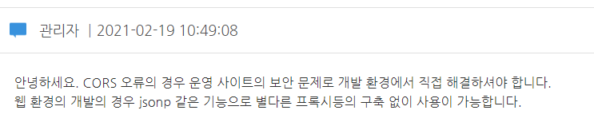

## 나는 어떻게 하다가 우회해서 요청을 날리게 되었나..?

위도, 경도를 받아오는 건 web api를 사용해서 받아왔다. 그런데 이것을 위치로 변경하려면 지도 api를 이용해서 받아와야 했다.

카카오 api같은 경우는 사용하기 너무 어려웠고 우리 프로젝트에 사용하기에는 무거울 것 같았다.(사용자도 많고.. 옵션도 많기때문에 더 오래걸릴것이라고 예상함) 그래서 가벼울 것이라고 예상되는 오픈 api를 사용해서 좌표로 위치를 검색하려고 했다!

vworld 라는 오픈 api를 제공하는 사이트에서 geocoder라는 api를 사용하게 되었다.

사용하기 쉬울 것이라는 예상과는 다르게 요청을 보냈더니 브라우저에서는 계속 cors 에러를 띄우는게 아닌가..?!!! 그래서 나는 이 cors에러를 정면돌파 하고자 vworld의 faq에 열심히 검색을 했었다. (이때까지만 해도 cors는 서버에 전화해서 포트번호 열어달라고 해야만 해결되는줄 알았음;; 개멍청;;)

다행히 나와 같은 상황을 가진 사람들이 많았고 관리자의 답변을 보니 보안상 jsonp를 이용해 우회해달라고 나와있었다. 흑흑.. 보안상이라고 나와있었지만 정확한 이유는 아직 모르겠다. (근데 jsonp 알고보니까 쓰면 안되는넘이었던것..)



개빡침ㄷㄷㄷㄷㄷㄷㄷㄷㄷ;;;;

프록시 패턴을 도입하려고 했지만 웹팩에서 어떤 이유인지 모르겠지만 마구마구 에러를 뿜어내고 제대로 작동하지 않았다. 그래서 jsonp를 사용하게 되었다~!! 처음에는 어려워보였지만 사실은 어렵지 않았던 것이었다. 하지만 이것을 사용하게되면서 후폭풍이 마구마구.. 일어났다는 사실.. ㅂㄷㅂㄷ

## 그래서 jsonp가 뭐라고?

**JSONP(JSON with Padding 또는 JSON-P)**

JSONP란 **CORS가 활성화 되기 이전**의 데이터 요청 방법으로, 다른 도메인으로부터 데이터를 가져오기 위해 사용하는 방법입니다. SOP에 따라 다른 도메인 간의 request를 제한하지만 **<script/> 태그**는 SOP 정책에 속하지 않는다는 것을 사용하여 서로 다른 도메인 간의 javascript 호출가능하게 합니다. JSONP를 사용하기 위해서는 필수적으로 서버에서 JSON의 포맷을 따라야 합니다.

- 클라이언트 단이 아닌, **다른 도메인**에 있는 서버로부터 데이터를 요청하는 경우 사용되는 데이터 포맷이다.
- JSON데이터를 클라이언트가 지정한 콜백함수로 감싸(padding) 클라이언트에 전송한다.
- 자바스크립트는 서로다른 도메인에 대한 요청을 보안상 제한한다. 개발을 하다보면 어절 수 없이 다른 도메인으로부터 데이터를 가져오는 상황이 발생하는데 이러한 이슈 때문에 JSONP방식을 사용한다.
- callback은 **서버에서 지원**해 주어야 한다.
- jsonp 데이터형식
  - 응답데이터는 Text형이다.
  - callback함수명으로 감싸진다.
  ```html
  var jsonp= callback({"key1":"value1" , "key2":"value2"})
  ```

### 동작방식

[http://main.com](http://main.com/) 에서 [http://test.com/result.json를](http://test.com/result.json%EB%A5%BC) ajax로 요청한다고 하면 SOP에 의해 오류가 발생합니다. 따라서 <script> 태그를 사용하여 호출해야 합니다. <script> 태그는 src 속성 값을 호출한 결과를 javascript로 불러와서 바로 실행시킵니다.

```html
<script type="text/javascript" src="http://test.com/result.json" />
```

위의 코드를 html에 선언하면 정상적으로 json URL을 호출 하지만 result.json 안에 있는 코드는 어떠한 객체를 정의해 놓은 코드이지 실행 코드가 아닙니다. 다시 말해, **result.json을 실행 코드**로 바꾸면 <script> 태그를 사용해 **다른 도메인의 데이터를 호출**할 수 있습니다. 이를 위해서 result.json 코드를 이제 아래처럼 변경합니다.

```html
// http://test.com/result.json 파일 callback({ name: "JSONP", discription:
"test" })
```

callback()은 함수를 실행시키는 구문이므로, **result.jsoon이 호출되면 callback() 안의 json이 반환**됩니다. 이제 result.json을 호출하는 html파일을 아래와 같이 추가 수정해줍니다.

```html
// http://main.com

<script type="text/javascript" src="http://test.com/result.json"></script>
<script>
  function callback(data) {
    // data는 result.json에서 선언한 데이터가 반환됨
  }
</script>
```

## 리액트로 jsonp 모듈을 설치해서 우회해보자!

### jsonp 모듈 설치

- axios에는 jsonp가 지원되지 않아서 직접 모듈을 설치해서 써야한다
  ```jsx
  npm i jsonp
  ```

### jsonp 사용방법

```bash
const getLocation = async () => {
    await jsonp(
      `http://api.vworld.kr/req/address?service=address&request=getAddress&version=2.0&crs=epsg:4326&point=${longitude},${latitude}&format=json&type=both&zipcode=false&simple=false&key=4298B5C8-D612-3961-95AA-F40692D47C8B`,
      (err, data) => {
        if (frontImg !== null) {
          console.log(data);
          setLocation(data.response.result[0].structure.level2);
        }
      }
    );
  };
```
