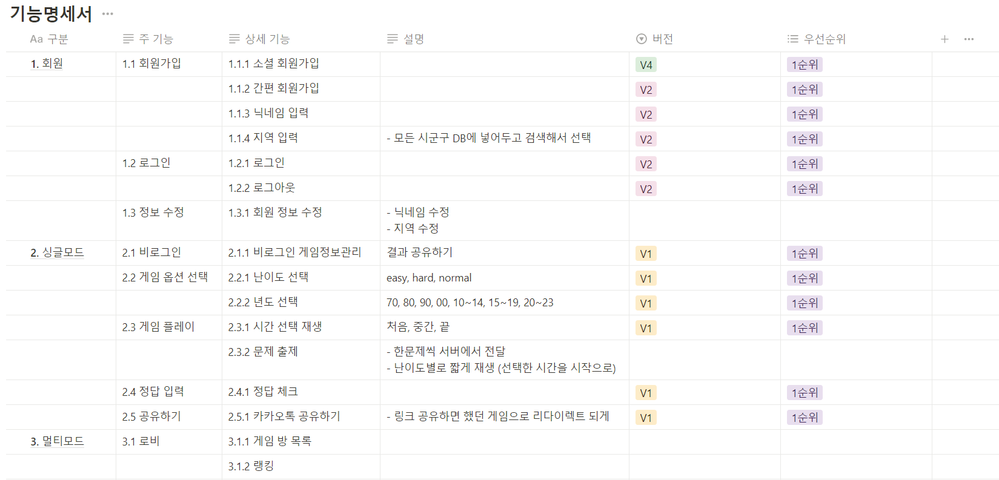
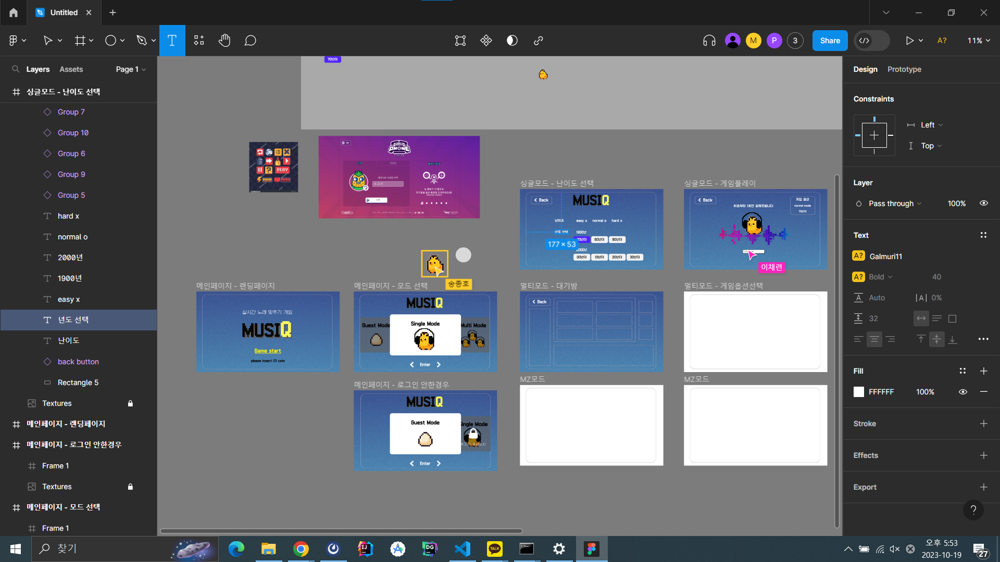
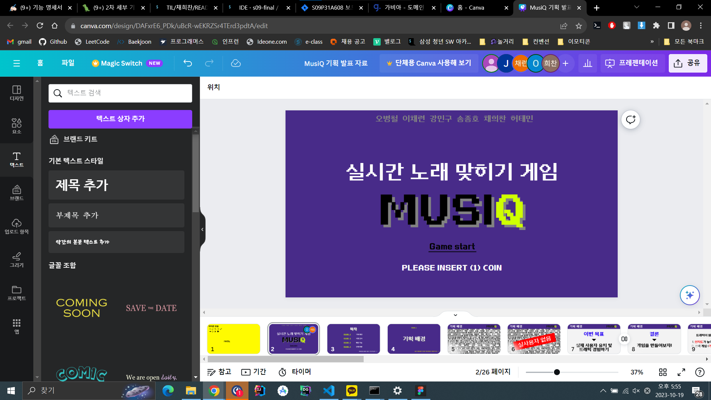

### 2023.10.12
# 아이디어 회의

### 반주 듣고 노래맞추기 1:1 게임
- 타겟이 넓음
- 주제가 자유로움
- 랭킹 시스템 도입
- 엔터테인먼트 요소 多

### 여행 사진 보고 장소 맞추기
- 나라의 편견을 버리고 사진으로만 여행지를 정할 수 있음
- 단순히 나라만 찾기 가능

### 2023.10.13

# 아이디어 확정

# 노래 1초 듣고 맞추기 1대1(단체 가능)

### 배경

사용자가 있는 서비스를 만들고 싶다 (최소 4000명)

- **트래픽** 받아보고 싶음 → 트래픽을 많이 받을 수 있는 간단한 게임이 유리함
- **모니터링 경험** 해봐야함 → **빠른 개발 후 빠른 배포** 필수

상용화된 노래 1대1 게임이 없음 → 블루오션

### 타겟

- 최대한 많은 사용자가 사용할 수 있는 서비스 지향

### 기능

- Youtube API
- **실시간**
- 장르를 선택 가능 → 모든 연령대의 대상 맞춤 가능
- 멀티모드, 싱글모드, MT모드
- 멀티모드 매칭 방식
    - 방 만들기 및 들어가기
    - 빠른 입장 (들어갈 수 있는 방 중 랜덤)
    - 티어 맟춤 대기열
- MT 모드 상세
    - STT (Speech To Text)를 사용하여 음성으로 답을 입력할 수 있도록
    - 진행bot (게임의 진행을 도와주도록 알고리즘)
- 추가 기능 (후보)
    - 놀라운 토요일 가사맞추기

### 기술

- 웹소켓
    - cron 스케줄링을 사용해서 실시간 갱신을 해줌
- 스프링 모니터링
    - 트래픽 이슈 해결
- 랭킹 시스템
    - redis 사용
- MSA
    - kafka or RabbitMQ
- 소나 큐브를 활용한 코드리뷰
- jenkins 무중단 배포
    - 개발 서버 운영 서버 나눠서 배포
- 로그인
    - Oauth → 소셜로그인

### 버전

- v0
    - 개인모드
- v1
    - 멀티 모드(1대1)
    - 랭킹
    - 로그인/회원가입
- v2
    - 멀티모드, MT모드

### 유사 서비스

예능 게임 모음

https://tvshowgame.pages.dev/

스타 유즈맵

[https://tipjem.com/스타크래프트-노래-맞추기-모음-카페-바로가기/](https://tipjem.com/%EC%8A%A4%ED%83%80%ED%81%AC%EB%9E%98%ED%94%84%ED%8A%B8-%EB%85%B8%EB%9E%98-%EB%A7%9E%EC%B6%94%EA%B8%B0-%EB%AA%A8%EC%9D%8C-%EC%B9%B4%ED%8E%98-%EB%B0%94%EB%A1%9C%EA%B0%80%EA%B8%B0/)

# 가사 맞추기

### 2023.10.16

# JPA에서 Dto 조회

---

**Entity로 조회시 발생한는 문제**

- Hibernate 캐시
- 불필요한 컬럼 조회
- OneToOne N+1 쿼리

→ 단순 조회 기능에서 성능 이슈 多

**Entity 조회**

- 실시간으로 Entity 변경이 필요한 경우

**Dto 조회**

- 고강도 성능 개성 or 대량의 데이터 조회가 필요한 경우

## 조회 컬럼 최소화 하기

```java
public List<BookPageDto> getBookPage (int bookNo, int pageNo) {
    return queryFactory
            .select(Projections.fields(BookPageDto.class,
                    book.name,
                    **Expressions.constantAs(bookNo, book.bookNo)**
                )
            )
            .from(book)
            .where(book.bookNo.eq(bookNo))
            .offset(pageNo)
            .limit(10)
            .fetch();
}
```

이미 알고있는 값에 대해서는 as 표현식을 사용하면 컬럼 조회를 줄일 수 있다.

## SELECT 컬럼에 Entity 자제

```java
@Transactional(readOnly = true)
public List<AdBond> createAdBond(LocalDate startDate, LocalDate endDate, List<String> orderTypes) {
    return queryFactory
            .select(Projections.fields(AdBond.class,
                    adItem.amount.sum().as("amount"),
                    adItem.txDate,
                    adItem.orderType,
                    **adItem.customer) // 불필요한 컬럼 조회 or N+1 발생**
            )
            .from(adItem)
            .where(adItem.orderType.in(orderTypes)
                    .and(adItem.txDate.between(startDate, endDate)))
            .groupBy(adItem.orderType, adItem.txDate, adItem.customer)
            .fetch();
}
```

Customer의 ID만 필요한 경우에도 customer의 모든 컬럼을 가져와야 하는 상황이 생긴다.
→ 일반적인 경우 N+1, Lazy Loading의 경우 쓰지 않는 컬럼 조회

### 한번 더 N+1
Cutomer와 @OneToOne 관계인 Shop이 매 건마다 함께 조회된다.

@OneToOne 관계에서는 Lazy Loading이 불가능 하기 때문에 **N+1이 무조건 발생**

+Shop에도 @OneToOne 관계가 있다면 N+1이 계속 발생한다.

## 해결 방안

연관된 Entity의 save를 위해서는 반대편 Entity의 Id만 있으면 되기 때문에

```java
@Transactional(readOnly = true)
public List<AdBond> createAdBond(LocalDate startDate, LocalDate endDate, List<String> orderTypes) {
    return queryFactory
            .select(Projections.fields(AdBond.class,
                    adItem.amount.sum().as("amount"),
                    adItem.txDate,
                    adItem.orderType,
                    **adItem.customer.id as("customerId")) // id만 직접 조회**
            )
            .from(adItem)
            .where(adItem.orderType.in(orderTypes)
                    .and(adItem.txDate.between(startDate, endDate)))
            .groupBy(adItem.orderType, adItem.txDate, adItem.customer)
            .fetch();
}
```

AdBond 생성시에는 new Customer(customerId)로 해결 가능

### 2023.10.17

# 게임 진행 방식

## V1

### 싱글모드

- 시작할 때 선택지
    - 난이도 선택 → 난이도에 따라 시간 정해짐
    - 년도 선택
- 시간
    1. 시작부터 몇 초간 듣기
    2. 버튼 3개를 누르면 재생 (처음, 중간, 끝부터 듣기)
        1. 1초 단위 기준
            1. easy : 2 , 2 , 2
            2. hard : 1, 1, 1
        2. 0.5 단위 기준
            1. easy : 2 , 2 , 2
            2. normal : 1, 1, 1
            3. hard : 0.5, 0.5, 0.5

- 노래 듣는 횟수 3번
- 게임 당 정답 횟수 몇 번? 3? 2?

- 년도
    - 단위
        - 70, 80, 90, 00년대는 100개씩
        - 70, 80, 90, 00년대, 10~14, 15~19, 20~23 복수선택 가능

- 정답보기
- 끝내기
    - 끝나면 맞은 개수 보여줌

## V2

### 싱글모드

- 모바일 반응형 제공
- 싱글모드
    - SNS 공유 기능

### 멀티 모드

- 로그인/회원가입
    - 간편 로그인 (아이디,비밀번호) → 닉네임
- 빠른 시작
    - 전체 목록에서 랜덤
- 방만들기
    - 방제목
    - 년도
    - 문제 수
        - 10, 30, 50
    - 비밀번호, 비밀방 체크2
        
- 힌트
    - 10초에 가수 초성
    - 20초에 제목 초성
- 스킵
    - 과반수 : 절반을 버리지말고 반올리지말고 올림
- 인원수
    - 6명
- 점수
    - 맞힌 문제수 x 1
- 레벨업
    - 경험치 : 20
- 한 판 끝나면 다시 방으로

### 2023.10.18



### 2023.10.19





