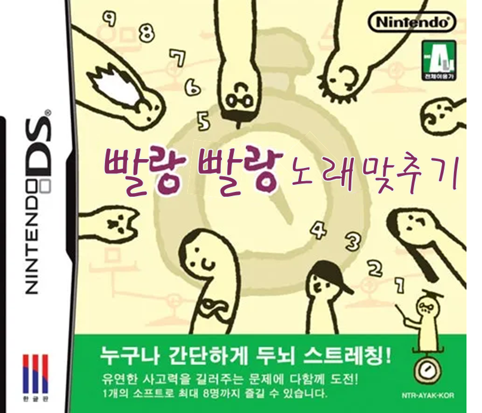
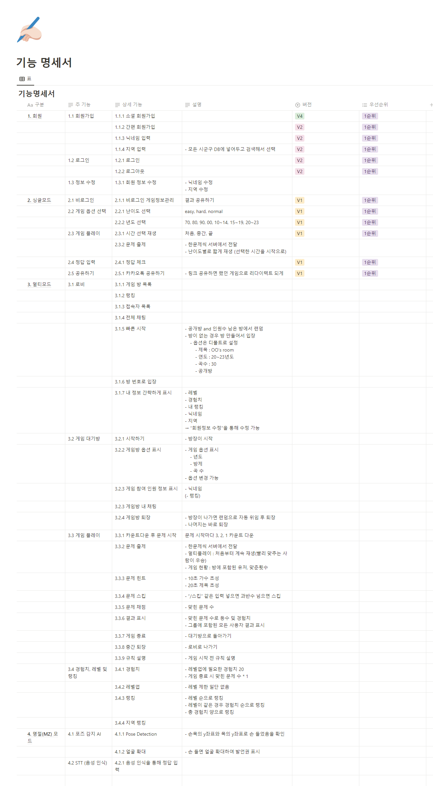

## 10/12

### 1. 게임 하나 특정 잡아서 [op.gg](http://op.gg/)

    op.gg와 비슷한 서비스가 현재 엄청 많음. 그래도 아직 없는 게임이나 기능이 없거나 ui가 아쉬운 서비스가 있기 때문에 게임의 랭킹이나, 아이템, 공략?을 정리한 서비스

### 2. 아이돌 팬층을 타겟으로?

    1. 인물퀴즈 같은 간단한 게임 여러개
    2. 아이돌의 사진을 꾸미고 꾸민 사진으로 투표 랭킹?, 랭킹을 기반으로 꾸미는 아이템 추가하거나, 메인에 등록하도록 해서 팬들의 팬심과 경쟁심을 자극

### 3. 예전 종호형 아이디어 - 미대생 졸작대상 또는 데뷔작 대상 경매 사이트?

    - 아이디어는 좋았는데 못 해서 아쉽, 그런데 실제 사용자를 가지기는 힘들 것 같은 느낌

### 4. 예전 희찬이 아이디어 - 노래 허밍 지식인.

    - 음은 알겠는데 무슨 노래일지 기억이 안날 때, 올릴 수 있는 사이트
    - 다른 사용자가 답변을 하는 개념
    - 오랫동안 못 맞추면, 챌린지 느낌으로 메인에 띄워도 될 것 같음
    - 또 내공처럼 포인트를 모아 랭킹을 하고, 분야별 랭킹 기반으로 자격증처럼 만들어서 주면 재밌을 것 같음 (ex. 걸그룹 정보 정복자)
    - 목소리 올리기 민망한 사람들을 위해 음성변조 기능 넣으면 좋을 듯

### 5. 챌린지 연습할 수 있는 사이트 만들어주기

    - 챌린지 안무 슬로우 모션, 가이드, 등의 기능으로 챌린지 연습 도움 사이트

## 10/13

# 컨설팅 전 기획 회의



# 노래 1초 듣고 맞추기 1대1(단체 가능)

### 배경

사용자가 있는 서비스를 만들고 싶다 (최소 4000명)

- **트래픽** 받아보고 싶음 → 트래픽을 많이 받을 수 있는 간단한 게임이 유리함
- **모니터링 경험** 해봐야함 → **빠른 개발 후 빠른 배포** 필수

상용화된 노래 1대1 게임이 없음 → 블루오션

### 타겟

- 최대한 많은 사용자가 사용할 수 있는 서비스 지향

### 기능

- Youtube API
- **실시간**
- 장르를 선택 가능 → 모든 연령대의 대상 맞춤 가능
- 멀티모드, 싱글모드, MT모드
- 멀티모드 매칭 방식
  - 방 만들기 및 들어가기
  - 빠른 입장 (들어갈 수 있는 방 중 랜덤)
  - 티어 맟춤 대기열
- MT 모드 상세
  - STT (Speech To Text)를 사용하여 음성으로 답을 입력할 수 있도록
  - 진행bot (게임의 진행을 도와주도록 알고리즘)
- 추가 기능 (후보)
  - 놀라운 토요일 가사맞추기

### 기술

- 웹소켓
  - cron 스케줄링을 사용해서 실시간 갱신을 해줌
- 스프링 모니터링
  - 트래픽 이슈 해결
- 랭킹 시스템
  - redis 사용
- MSA
  - kafka or RabbitMQ
- 소나 큐브를 활용한 코드리뷰
- jenkins 무중단 배포
  - 개발 서버 운영 서버 나눠서 배포
- 로그인
  - Oauth → 소셜로그인
- 포즈 인식

[https://puleugo.tistory.com/17](https://puleugo.tistory.com/17)

### 버전

- v0
  - 개인모드
- v1
  - 멀티 모드(1대1)
  - 랭킹
  - 로그인/회원가입
- v2
  - 멀티모드, MT모드

### 유사 서비스

예능 게임 모음

[https://tvshowgame.pages.dev/](https://tvshowgame.pages.dev/)

스타 유즈맵

[https://tipjem.com/스타크래프트-노래-맞추기-모음-카페-바로가기/](https://tipjem.com/%EC%8A%A4%ED%83%80%ED%81%AC%EB%9E%98%ED%94%84%ED%8A%B8-%EB%85%B8%EB%9E%98-%EB%A7%9E%EC%B6%94%EA%B8%B0-%EB%AA%A8%EC%9D%8C-%EC%B9%B4%ED%8E%98-%EB%B0%94%EB%A1%9C%EA%B0%80%EA%B8%B0/)

# 가사 맞추기


## 10/16

### Pose Detection

### 정리 링크

[[파이썬] MediaPipe 포즈 감지(Pose)](https://puleugo.tistory.com/17)

### 전체 코드

```python
import cv2
import mediapipe as mp

# MediaPipe Pose 모델 초기화
mp_pose = mp.solutions.pose
mp_drawing = mp.solutions.drawing_utils

# 카메라 캡처 초기화
cap = cv2.VideoCapture(0)
frame_rate = 33

# Pose 모델 생성
pose = mp_pose.Pose(min_detection_confidence=0.5, min_tracking_confidence=0.5)

# 확대 처리를 위한 boolean
zoomed_in = False

while cap.isOpened():
    ret, frame = cap.read()
    if not ret:
        continue

    # 이미지를 RGB 포맷으로 변환
    frame_rgb = cv2.cvtColor(frame, cv2.COLOR_BGR2RGB)

    # 포즈 랜드마크 감지
    results = pose.process(frame_rgb)

    if results.pose_landmarks:
        landmarks = results.pose_landmarks.landmark

        h, w, _ = frame.shape
        if landmarks[11].y > landmarks[18].y and not zoomed_in:
            x1 = int(w / 4)
            y1 = int(h / 4)
            x2 = int(3 * w / 4)
            y2 = int(3 * h / 4)
            frame = frame[y1:y2, x1:x2]
            zoomed_in = True
        elif (landmarks[11].y < landmarks[18].y and zoomed_in):
            frame = cv2.resize(frame, (w, h))
            zoomed_in = False


    if results.pose_landmarks:
        # 포즈 랜드마크 그리기
        mp_drawing.draw_landmarks(frame, results.pose_landmarks, mp_pose.POSE_CONNECTIONS)

    # 화면에 영상 표시
    cv2.imshow('Pose Detection', frame)

    if cv2.waitKey(1) & 0xFF == ord('q'):
        break

# 종료 시 리소스 해제
cap.release()
cv2.destroyAllWindows()
```

### 코드 설명

### Solution 불러오기

```python
# MediaPipe Pose 모델 초기화
mp_pose = mp.solutions.pose
mp_drawing = mp.solutions.drawing_utils
```

- MediaPipe에서 제공하는 솔루션을 가져오는 코드
- mp.solution..pose → pose detection 모델을 생성할 수 있음
- mp.solution.drawing → pose detection의 결과인 pose landmarks를 frame에 그릴 수 있도록 도와줌

### 캠 사용

```python
# 카메라 캡처 초기화
cap = cv2.VideoCapture(0)
frame_rate = 33
```

캠을 사용하기 위한 코드

- openCV 사용
- VideoCapture의 파라미터로 URL이나 영상의 경로를 입력하면 해당 영상을 실행하고, 0을 입력하면 컴퓨터의 캠을 사용함

### 모델 생성

```python
# Pose 모델 생성
pose = mp_pose.Pose(min_detection_confidence=0.5, min_tracking_confidence=0.5)
```

- 모델 생성하는 코드
- 파라미터
  - **[3.1. STATIC*IMAGE_MODE (정적*이미지\_모드)](<https://puleugo.tistory.com/17#article-3-1--static_image_mode-(%EC%A0%95%EC%A0%81_%EC%9D%B4%EB%AF%B8%EC%A7%80_%EB%AA%A8%EB%93%9C)>)**
  - **[3.2. MODEL*COMPLEXITY (모델*복잡성)](<https://puleugo.tistory.com/17#article-3-2--model_complexity-(%EB%AA%A8%EB%8D%B8_%EB%B3%B5%EC%9E%A1%EC%84%B1)>)**
  - **[3.3. SMOOTH*LANDMARKS (부드러운*랜드마크)](<https://puleugo.tistory.com/17#article-3-3--smooth_landmarks-(%EB%B6%80%EB%93%9C%EB%9F%AC%EC%9A%B4_%EB%9E%9C%EB%93%9C%EB%A7%88%ED%81%AC)>)**
  - **[3.4. ENABLE*SEGMENTATION (분할*허용)](<https://puleugo.tistory.com/17#article-3-4--enable_segmentation-(%EB%B6%84%ED%95%A0_%ED%97%88%EC%9A%A9)>)**
  - **[3.5. SMOOTH*SEGMENTATION (부드러운*분할)](<https://puleugo.tistory.com/17#article-3-5--smooth_segmentation-(%EB%B6%80%EB%93%9C%EB%9F%AC%EC%9A%B4_%EB%B6%84%ED%95%A0)>)**
  - **[3.6. MIN*DETECTION_CONFIDENCE (최소*탐지\_신뢰값)](<https://puleugo.tistory.com/17#article-3-6--min_detection_confidence-(%EC%B5%9C%EC%86%8C_%ED%83%90%EC%A7%80_%EC%8B%A0%EB%A2%B0%EA%B0%92)>)**
  - **[3.7. MIN*TRACKING_CONFIDENCE (최소*추적\_신뢰값)](<https://puleugo.tistory.com/17#article-3-7--min_tracking_confidence-(%EC%B5%9C%EC%86%8C_%EC%B6%94%EC%A0%81_%EC%8B%A0%EB%A2%B0%EA%B0%92)>)**
  ```python
  각 파라미터의 내용은 아직 이해가 필요함
  ```

### Detection 부분 코드

```python
while cap.isOpened():
    ret, frame = cap.read()
    if not ret:
        continue

    # 이미지를 RGB 포맷으로 변환
    frame_rgb = cv2.cvtColor(frame, cv2.COLOR_BGR2RGB)

    # 포즈 랜드마크 감지
    results = pose.process(frame_rgb)

    if results.pose_landmarks:
        landmarks = results.pose_landmarks.landmark

        h, w, _ = frame.shape
        if landmarks[11].y > landmarks[18].y and not zoomed_in:
            x1 = int(w / 4)
            y1 = int(h / 4)
            x2 = int(3 * w / 4)
            y2 = int(3 * h / 4)
            frame = frame[y1:y2, x1:x2]
            zoomed_in = True
        elif (landmarks[11].y < landmarks[18].y and zoomed_in):
            frame = cv2.resize(frame, (w, h))
            zoomed_in = False


    if results.pose_landmarks:
        # 포즈 랜드마크 그리기
        mp_drawing.draw_landmarks(frame, results.pose_landmarks, mp_pose.POSE_CONNECTIONS)

    # 화면에 영상 표시
    cv2.imshow('Pose Detection', frame)

    if cv2.waitKey(1) & 0xFF == ord('q'):
        break
```

- pose.process 함수를 통해 detection
- 우리가 필요한 정보는 landmarks
  - 각 포인트의 좌표와 가시성? 값을 담고 있음
  - 프레임마다 33개의 landmark를 가지고 있음
  ```python
  0: 오른쪽 골반 (Right Hip)
  1: 왼쪽 골반 (Left Hip)
  2: 오른쪽 아래 다리 (Right Knee)
  3: 왼쪽 아래 다리 (Left Knee)
  4: 오른쪽 발목 (Right Ankle)
  5: 왼쪽 발목 (Left Ankle)
  6: 오른쪽 어깨 (Right Shoulder)
  7: 왼쪽 어깨 (Left Shoulder)
  8: 오른쪽 팔꿈치 (Right Elbow)
  9: 왼쪽 팔꿈치 (Left Elbow)
  10: 오른쪽 손목 (Right Wrist)
  11: 왼쪽 손목 (Left Wrist)
  12: 머리 (Head)
  13: 오른쪽 눈 (Right Eye)
  14: 왼쪽 눈 (Left Eye)
  15: 오른쪽 귀 (Right Ear)
  16: 왼쪽 귀 (Left Ear)
  17: 가운데 골반 (Hip)
  18: 목 (Neck)
  19: 배 (Abdomen)
  20: 배꼽 (Navel)
  21: 가슴 (Chest)
  22: 오른쪽 발 뒤쪽 (Right Heel)
  23: 왼쪽 발 뒤쪽 (Left Heel)
  24: 오른쪽 바깥 발 (Right Out of Foot)
  25: 왼쪽 바깥 발 (Left Out of Foot)
  26: 오른쪽 손가락 끝 (Right Pinky)
  27: 왼쪽 손가락 끝 (Left Pinky)
  28: 오른쪽 엄지손가락 끝 (Right Thumb)
  29: 왼쪽 엄지손가락 끝 (Left Thumb)
  30: 오른쪽 손목 뒤쪽 (Right Wrist Back)
  31: 왼쪽 손목 뒤쪽 (Left Wrist Back)
  32: 가슴 윗 부분 (Upper Chest)
  ```
- 손 들기 감지
  ```python
  if landmarks[11].y > landmarks[18].y and not zoomed_in:
  ```
  - 이 코드를 통해 손 들기 처리를 함
  - 왼쪽 손목으로 했는데 실행하면 오른쪽 손목만 감지함
  - 일단 11번 (왼쪽 손목) 랜드마크의 y좌표가 18번 (목) 랜드마크의 y좌표보다 크면 들었다고 판단하도록 함

## 챌린지

1. 여러명을 감지할 수 있도록 보완
2. 현재는 확대 관련 코드를 넣었지만 실패, 손 들면 얼굴을 확대하도록 보완

## 10/17

### 로그인/회원가입, 랭킹

- 로그인/회원가입 → 스킵 가능
  - 싱글모드는 로그인 없이 로컬 스토리지로
  - 멀티모드는 로그인 있게 구현
  - 회원가입은 소셜, 간편 둘다 가능
  - 간편 회원가입에는 아이디, 비밀번호 입력
  - → 닉네임, 지역 입력
- 랭킹은 실시간 or 3분 or 하루
- 지역별 랭킹도 있으면 좋을듯

### 게임 진행 방식

### V1

### 싱글모드

- 시작할 때 선택지
  - 난이도 선택 → 난이도에 따라 시간 정해짐
  - 년도 선택
- 시간
  1. 시작부터 몇 초간 듣기
  2. 버튼 3개를 누르면 재생 (처음, 중간, 끝부터 듣기)
     1. 1초 단위 기준
        1. easy : 2 , 2 , 2
        2. hard : 1, 1, 1
     2. 0.5 단위 기준
        1. easy : 2 , 2 , 2
        2. normal : 1, 1, 1
        3. hard : 0.5, 0.5, 0.5
- 노래 듣는 횟수 3번
- 게임 당 정답 횟수 몇 번? 3? 2?
- 년도
  - 단위
    - 70, 80, 90, 00년대는 100개씩
    - 70, 80, 90, 00년대, 10~14, 15~19, 20~23 복수선택 가능


- 정답보기
- 끝내기
  - 끝나면 맞은 개수 보여줌

### V2

### 싱글모드

- 모바일 반응형 제공
- 싱글모드
  - SNS 공유 기능

### 멀티 모드

- 로그인/회원가입
  - 간편 로그인 (아이디,비밀번호) → 닉네임
- 빠른 시작
  - 전체 목록에서 랜덤
- 방만들기
  - 방제목
  - 년도
  - 문제 수
    - 10, 30, 50
  - 비밀번호, 비밀방 체크2
    
- 힌트
  - 10초에 가수 초성
  - 20초에 제목 초성
- 스킵
  - 과반수 : 절반을 버리지말고 반올리지말고 올림
- 인원수
  - 6명
- 점수
  - 맞힌 문제수 x 1
- 레벨업
  - 경험치 : 20
- 한 판 끝나면 다시 방으로

## V3

### MZ모드


## 10/13

- 기획 회의 마무리
- 기능 명세 작성
  - 회원 관리
  - 싱글 모드
  - 멀티 모드
  - MZ(명절) 모드



## 10/19

- 기능 명세서 마무리
- 발표 자료 제작  
  [피피티링크](https://www.canva.com/design/DAFxrE6_PDk/uBcR-wEKRZSr4TErd3pdtA/edit?utm_content=DAFxrE6_PDk&utm_campaign=designshare&utm_medium=link2&utm_source=sharebutton)

## 10/20

- 발표 자료 준비
  - Figma 및 PowerPoint 제작
- 발표 진행
  - 발표 중 생각보다 주변을 둘러 볼 여유가 없어서 아쉬웠음
  - 좀 더 여유 있게 발표를 하려면 더 많은 연습이 필요할 것 같음
- 회고록 작성
